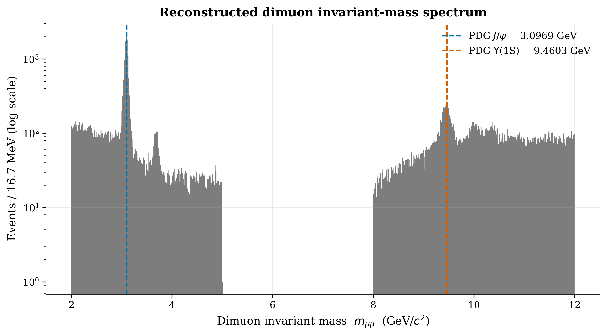
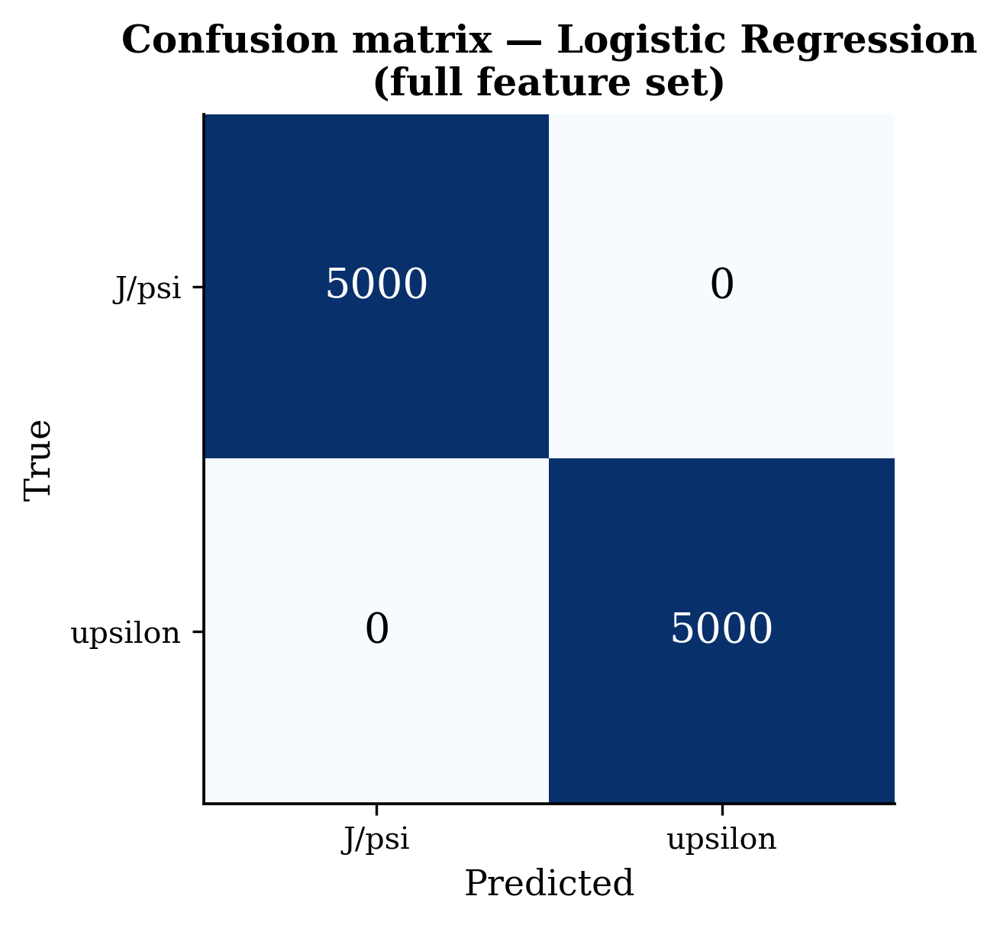
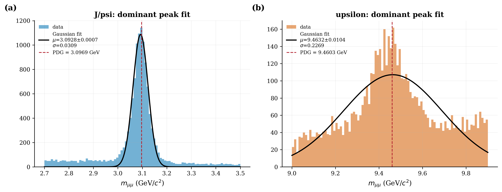
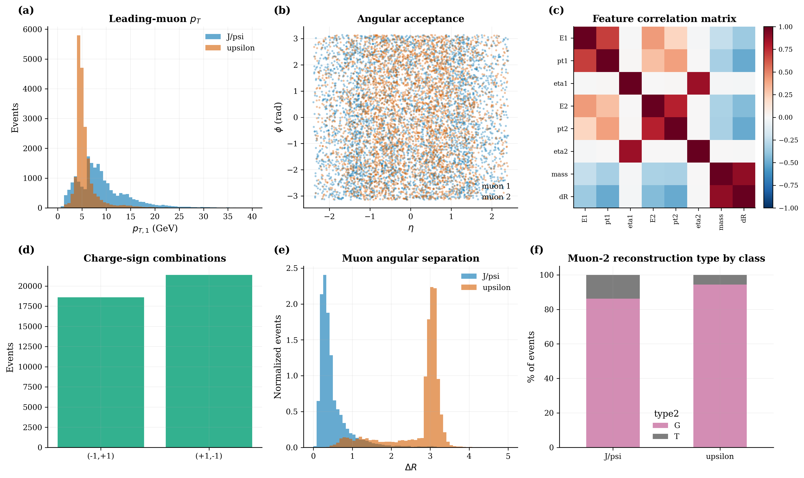
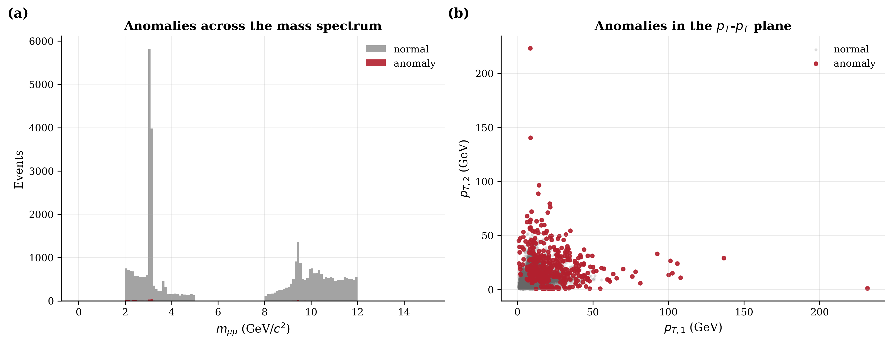
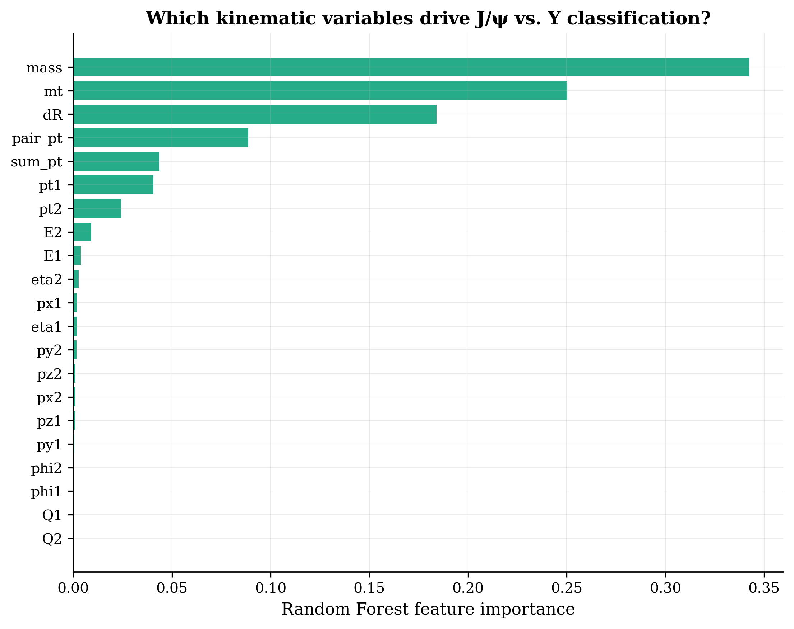
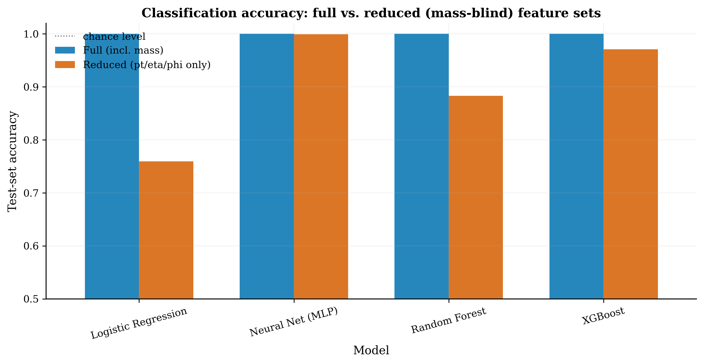
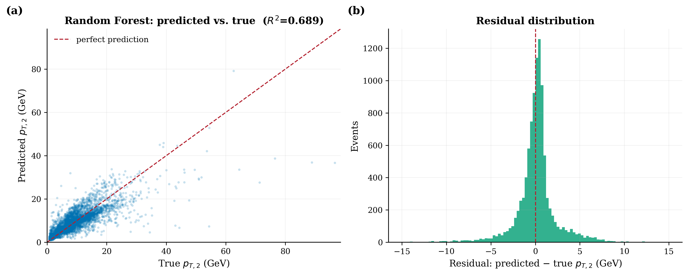

# Dimuon Resonance Analysis: Reconstructing the J/ψ and Υ Mesons from CMS Open Data

[](http://opendata.cern.ch/)
[](https://creativecommons.org/publicdomain/zero/1.0/)
[](https://www.python.org/)

A self-contained physics + machine-learning analysis of 40,000 dimuon (μ⁺μ⁻) events recorded by the CMS
detector at the LHC in 2011. Starting from raw muon four-momenta only, the analysis reconstructs the
**J/ψ** (charmonium, *c c̄*) and **Υ** (bottomonium, *b b̄*) resonance peaks, characterizes event kinematics,
flags anomalous outlier events, trains classifiers to discriminate the two species, builds a regression
model for muon kinematics, and ships an interactive Plotly dashboard for exploring the mass spectrum.

---

## Table of contents

- [Overview](#overview)
- [Repository structure](#repository-structure)
- [Dataset](#dataset)
- [Methodology](#methodology)
- [Results](#results)
- [Setup & reproducing](#setup--reproducing)
- [Key findings](#key-findings)
- [Suggested extensions](#suggested-extensions)
- [Citation & license](#citation--license)

---

## Overview

Two-muon events selected from the CMS `DoubleMu` primary dataset are used to reconstruct the invariant
mass of the parent resonance decaying to μ⁺μ⁻. Using **only the measured four-momenta of the two muons**,
the analysis:

1. Recovers the J/ψ and Υ resonance peaks at their known PDG masses to within a few MeV.
2. Characterizes detector acceptance and event kinematics (p_T, η, φ, charge, angular separation).
3. Identifies anomalous outlier events with an Isolation Forest.
4. Trains and compares four classifiers (Logistic Regression, Random Forest, Neural Net, XGBoost) to
   discriminate J/ψ vs. Υ from kinematics alone — with and without direct access to invariant mass.
5. Builds a regression model predicting one muon's p_T from the other muon's kinematics and event geometry.
6. Provides an interactive Plotly dashboard for exploring the mass spectrum and kinematic correlations.

The notebook is organized as a linear research workflow:

```
data → feature engineering → physics reconstruction → visualization →
anomaly detection → machine learning → interactive exploration → conclusions
```

## Repository structure

```
dimuon-resonance-analysis/
├── data/           # Raw / processed CMS Open Data (dimuon event tables)
├── figs/           # Exported figures (PNG) referenced in this README
└── notebooks/      # Jupyter notebook containing the full analysis
```

| Path | Contents |
|---|---|
| `notebooks/dimuon_resonance_analysis.ipynb` | Full analysis: EDA → physics reconstruction → ML → dashboard |
| `data/` | Dimuon event tables (J/ψ and Υ candidate samples) |
| `figs/` | Static exports of all figures produced by the notebook |

## Dataset

- **Source:** CMS Open Data, [J/ψ→μμ (record 5203)](http://opendata.cern.ch/record/5203) and
  [Υ→μμ (record 5206)](http://opendata.cern.ch/record/5206), released under **CC0**.
- **Size:** 40,000 events (20,000 J/ψ-selected + 20,000 Υ-selected).
- **Granularity:** one row per event, containing two reconstructed muon candidates (`1`, `2`).

| Field | Description |
|---|---|
| `E1,px1,py1,pz1` / `E2,px2,py2,pz2` | Muon four-momentum components (GeV) |
| `pt1,pt2` | Transverse momentum (GeV) |
| `eta1,eta2` | Pseudorapidity |
| `phi1,phi2` | Azimuthal angle (rad) |
| `Q1,Q2` | Electric charge (±1) |
| `type1,type2` | Reconstruction type (**G** = global muon, **T** = tracker muon) |
| `class` | Target label: `J/psi` or `upsilon` |

Derived features engineered in the notebook: `mass` (dimuon invariant mass), `mt` (transverse mass),
`dR` (angular separation ΔR), `pair_pt`, `sum_pt`, `deta`, `dphi`.

## Methodology

### 1. Physics reconstruction
The dimuon invariant mass is computed directly from the two muon four-vectors:

```
m_μμ = sqrt( (E1+E2)² − (px1+px2)² − (py1+py2)² − (pz1+pz2)² )
```

Dominant peaks are fit with a single Gaussian (`scipy.optimize.curve_fit`) against PDG reference values.

### 2. Anomaly detection
An `IsolationForest` (300 trees, contamination = 1%) is trained on standardized kinematic features
(`E1, pt1, eta1, E2, pt2, eta2, mass, dR`) to flag outlier events.

### 3. Classification
Four models — Logistic Regression, Random Forest, MLP Neural Net, and XGBoost — are trained to predict
`class` (J/ψ vs. Υ) under two feature sets:

- **Full** — all 21 kinematic features, including `mass`.
- **Reduced (mass-blind)** — only `pt`, `eta`, `phi` for both muons (6 features), with `mass` and its
  correlates deliberately excluded.

### 4. Regression
`RandomForestRegressor` and `XGBRegressor` predict the sub-leading muon's p_T (`pt2`) from the leading
muon's kinematics and pair geometry (`pt1, eta1, phi1, eta2, phi2, dR, deta, dphi`), evaluated on a 25%
held-out test split.

### 5. Interactive dashboard
A Plotly dashboard with a dropdown filter (All / J/ψ / Υ) and range slider lets users explore the mass
spectrum and the p_T,1–p_T,2 plane without re-running code.

## Results

### Mass spectrum reconstruction



Both resonances appear cleanly on a log-scale histogram, alongside visible substructure: the ψ(2S) shoulder
near 3.7 GeV and the Υ(1S,2S,3S) triplet hidden inside the single `upsilon` class label.


*(J/ψ and Υ candidates shown separately by class label, resolving the Υ(1S/2S/3S) substructure.)*

### Gaussian peak fits vs. PDG values



| Resonance | Fitted μ (GeV) | PDG mass (GeV) | Fitted σ (GeV) |
|---|---|---|---|
| J/ψ | 3.0928 ± 0.0007 | 3.0969 | 0.0309 |
| Υ(1S) | 9.4632 ± 0.0104 | 9.4603 | 0.2269 |

### Kinematics overview



- Leading-muon p_T is systematically higher for Υ events than J/ψ events, consistent with the larger
  parent mass.
- Every event satisfies charge conservation: only (−1,+1) and (+1,−1) charge combinations occur.
- ΔR (angular separation) clearly separates the two classes — J/ψ muons are far more collimated.
- Detector acceptance is uniform in φ but geometrically cut off at |η| ≈ 2.4.
- ~85–95% of sub-leading muons are reconstructed as global muons (type **G**) rather than tracker-only.

### Anomaly detection



The Isolation Forest flags ~1% of events as anomalous, concentrated at high p_T and near the edge of
detector acceptance — the region where reconstruction is least reliable.

### Classification



`mass`, `mt` (transverse mass), and `dR` dominate the Random Forest's feature importance, as expected
since they most directly encode the parent resonance's kinematics.


With the full feature set (including `mass`), all models trivially separate the two classes
(Logistic Regression achieves a perfect confusion matrix: 5000/5000 correct in each class).



| Model | Full feature set | Reduced (mass-blind) |
|---|---|---|
| Logistic Regression | ~1.00 | ~0.76 |
| Neural Net (MLP) | ~1.00 | ~1.00 |
| Random Forest | ~1.00 | ~0.88 |
| XGBoost | ~1.00 | ~0.97 |

Even without direct access to `mass`, tree-based and neural models recover most of the separating signal
from `p_T`, `η`, `φ` alone — evidence that p_T implicitly encodes parent mass in a way only non-linear
models can exploit. Logistic Regression, being linear, cannot.

### Regression



The Random Forest regressor predicts the sub-leading muon's p_T with R² = 0.689; residuals are centered
near zero but show a heavier tail at high p_T, where training statistics are sparser.

## Setup & reproducing

```bash
git clone https://github.com/SiddharthMaverick/dimuon-resonance-analysis.git
cd dimuon-resonance-analysis
pip install numpy pandas matplotlib scipy scikit-learn xgboost plotly jupyter
jupyter notebook notebooks/dimuon_resonance_analysis.ipynb
```

**Dependencies:** `numpy`, `pandas`, `matplotlib`, `scipy`, `scikit-learn`, `xgboost`, `plotly`.

Run all cells top to bottom; figures are exported to a local `figs_nb/` directory as the notebook executes,
and the interactive dashboard renders inline via Plotly.

## Key findings

- **Physics reconstruction.** Raw four-momenta alone recover both the J/ψ and Υ resonances at their known
  PDG masses to within a few MeV, and additionally resolve the Υ(1S, 2S, 3S) substructure hidden inside
  the single `upsilon` class label — a genuine physics result hiding in what looked like routine EDA.
- **Kinematics.** Every event obeys charge conservation (Q₁Q₂ = −1); Υ decay muons are systematically
  higher-p_T and less angularly collimated than J/ψ muons, both direct consequences of the larger parent
  mass; detector acceptance is uniform in φ but geometrically cut off at |η| ≈ 2.4.
- **Anomaly detection.** An Isolation Forest flags ~1% of events as kinematic outliers, concentrated at
  high p_T and near the edge of detector acceptance — physically the region where measurement is least
  reliable, and disproportionately affecting J/ψ-labelled events since high-p_T muons are intrinsically
  rarer for the lighter resonance.
- **Classification.** Mass-inclusive features trivially separate the two species (>99% accuracy across all
  models). The more informative result is that even a mass-blind feature set (p_T, η, φ only) lets
  tree-based models recover most of the separating signal non-linearly, while linear models cannot.
- **Regression.** A sub-leading muon's p_T can be predicted from the leading muon's kinematics and pair
  geometry with meaningful (though imperfect) accuracy, unbiased but with a heavier tail at high p_T where
  training statistics are sparser.

## Suggested extensions

1. Fit the Υ(1S/2S/3S) triplet explicitly with a 3-Gaussian model to extract each state's yield and mass
   splitting.
2. Use per-run calibration to check for detector-level mass-scale drift across `Run` numbers.
3. Extend the classifier to a 4-class problem separating the individual Υ states.
4. Deploy the interactive dashboard as a standalone Streamlit app.

## Citation & license

**Data:** CMS Collaboration, 2011 Open Data, released under [CC0](https://creativecommons.org/publicdomain/zero/1.0/).
Records: [J/ψ→μμ (5203)](http://opendata.cern.ch/record/5203), [Υ→μμ (5206)](http://opendata.cern.ch/record/5206).

This analysis was performed for educational purposes and is **not an official CMS physics result**.

If you use this repository, please cite the CMS Open Data records above alongside this repository.